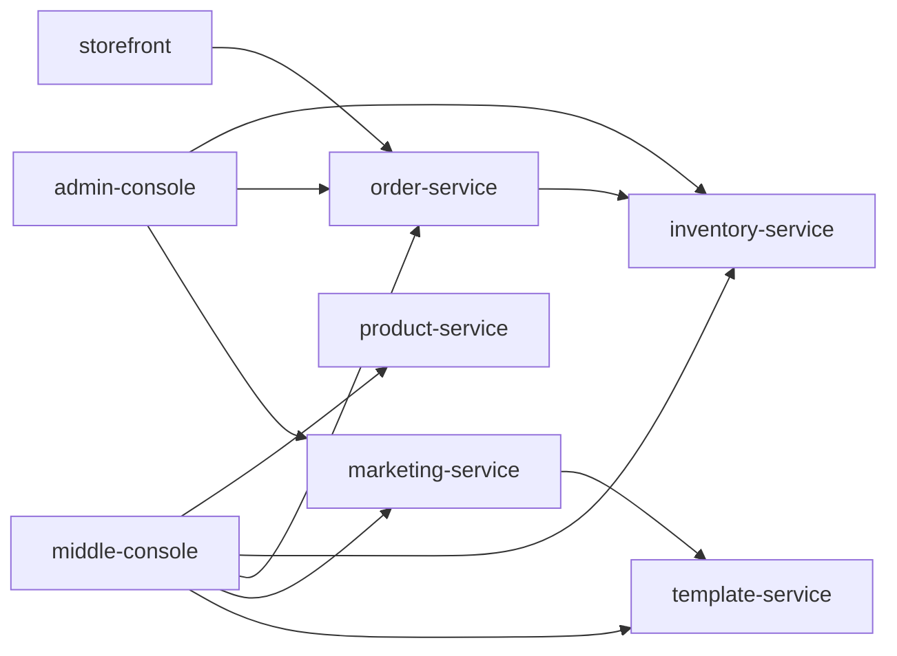

# 架构说明

## 项目目的

这个项目用于演示电商系统里前台、中台、后台的职责边界，以及共享后端能力在多个系统中的复用方式。

项目没有使用统一网关收口业务请求，而是保留了直接的服务调用关系，便于观察：

- 哪个系统在调用哪个服务
- 哪个服务又依赖了别的服务
- 哪些能力是多个系统共同使用的

## 系统划分

### 前台

前台对应 `apps/storefront`，负责消费者视角的页面：

- 商品浏览
- 活动会场
- 下单
- 订单查看

前台面向用户，但并不自己维护订单、库存、活动数据。相关数据和动作都来自后端能力中心。

### 中台

中台对应 `apps/middle-console`，负责能力管理视角的页面：

- 商品中心
- 库存中心
- 订单中心
- 营销中心
- 搭建中心

中台不是运营后台，也不是消费者页面。它展示并管理的是平台级能力本身。

### 后台

后台对应 `apps/admin-console`，负责商家和运营视角的页面：

- 补货
- 发货
- 活动投放
- 商品管理
- 交易管理
- 客服售后

后台的定位是操作台。它负责发起业务动作，但不负责承载这些动作背后的共享能力。

## 后端服务

### `product-service`

负责商品主数据：

- 商品列表
- 商品详情

### `inventory-service`

负责库存能力：

- 库存预警
- 补货
- 订单占用库存

### `order-service`

负责订单能力：

- 创建订单
- 查询订单
- 发货
- 联动日志输出

### `marketing-service`

负责活动能力：

- 查询活动
- 直接发布活动
- 基于模板生成活动实例

### `template-service`

负责模板能力：

- 查询模板列表
- 查询模板详情

## 服务复用关系

这套项目最重要的部分是服务复用关系，而不是页面结构。

### 复用点 1：库存能力

`inventory-service` 被多个系统和服务共同使用：

- `order-service` 调用它扣减库存
- `admin-console` 调用它执行补货
- `middle-console` 读取它的库存预警

也就是说，库存能力不属于前台，也不属于后台，而是单独的共享能力。

### 复用点 2：模板能力

`template-service` 被多个系统和服务共同使用：

- `marketing-service` 调用它获取模板并生成活动实例
- `middle-console` 直接读取它展示模板库

模板能力本身归中台；后台只是使用模板能力做活动投放。

### 复用点 3：订单能力

`order-service` 也存在明显的多方复用：

- `storefront` 调用它创建订单
- `admin-console` 调用它发货
- `middle-console` 读取它展示订单中心

订单生命周期由同一个服务维护，不会出现前台一套订单、后台一套订单、中台再来一套订单的情况。

## 典型业务链路

### 1. 前台下单

调用链：

`storefront -> order-service -> inventory-service`

处理过程：

1. 前台提交订单
2. `order-service` 校验请求并创建订单上下文
3. `order-service` 调用 `inventory-service` 预占库存
4. `inventory-service` 扣减共享库存
5. `order-service` 写入订单
6. 中台和后台读取到同一笔新订单

### 2. 后台补货

调用链：

`admin-console -> inventory-service`

处理过程：

1. 后台选择 SKU 和补货数量
2. `inventory-service` 更新库存
3. 前台商品页、中台库存中心、后台商品页读取到同一份库存结果

### 3. 后台投放模板活动

调用链：

`admin-console -> marketing-service -> template-service`

处理过程：

1. 后台选择模板并发起投放
2. `marketing-service` 接收投放请求
3. `marketing-service` 调用 `template-service` 读取模板
4. `marketing-service` 基于模板生成活动实例
5. 前台首页读取新的活动主题
6. 中台营销中心和搭建中心可以看到活动实例与模板来源

## 为什么模板能力放中台

模板能力和活动投放是两件事。

模板能力包含：

- 页面结构
- 主题皮肤
- 文案槽位
- 视觉风格

这些内容比较稳定，且会被多次复用，适合放在中台沉淀为模板中心。

活动投放包含：

- 选择模板
- 设置活动名称
- 设置投放渠道
- 设置优惠形式
- 上线活动

这些内容属于运营动作，适合放在后台。

因此：

- 中台负责模板能力
- 后台负责模板使用
- 前台负责结果展示

## 代码位置

前端：

- [apps/host/src/App.jsx](./apps/host/src/App.jsx)
- [apps/storefront/src/App.jsx](./apps/storefront/src/App.jsx)
- [apps/middle-console/src/App.jsx](./apps/middle-console/src/App.jsx)
- [apps/admin-console/src/App.jsx](./apps/admin-console/src/App.jsx)

后端：

- [services/product-service/src/server.js](./services/product-service/src/server.js)
- [services/inventory-service/src/server.js](./services/inventory-service/src/server.js)
- [services/order-service/src/server.js](./services/order-service/src/server.js)
- [services/marketing-service/src/server.js](./services/marketing-service/src/server.js)
- [services/template-service/src/server.js](./services/template-service/src/server.js)
- [services/shared/store.js](./services/shared/store.js)
