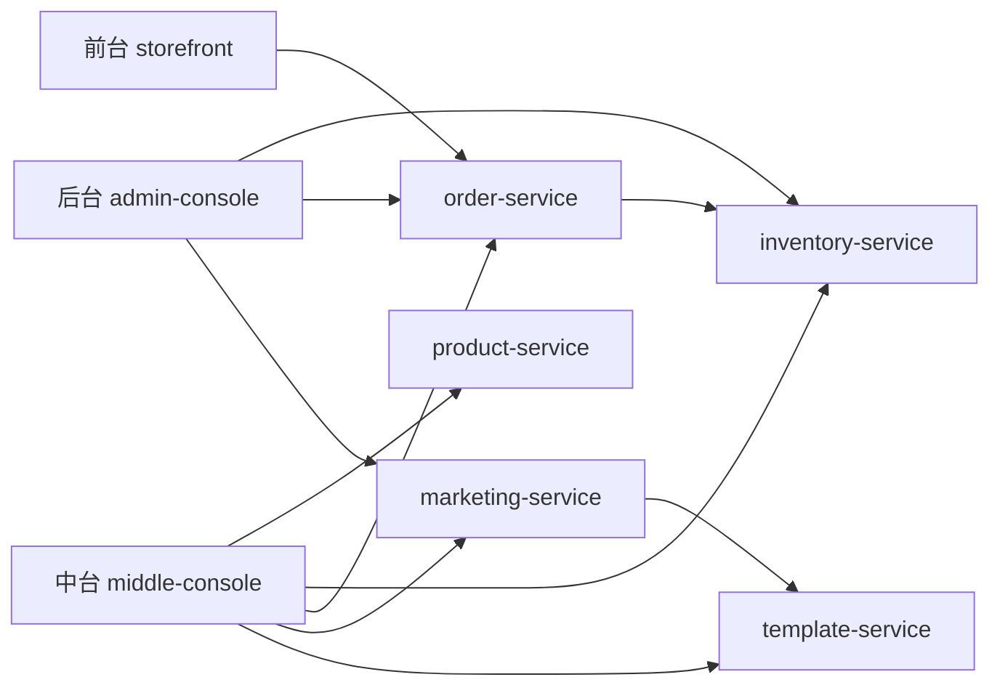

# 电商前台 / 中台 / 后台联动说明

这份文档只解释当前这份 demo 的真实实现，不讲抽象空话。

## 1. 结论先说清楚

这套 demo 想说明的是：

- 前台负责卖货和下单
- 后台负责人工操作和运营动作
- 中台负责沉淀并提供商品、库存、订单、营销、模板这些共享能力

关键不是“页面长得不一样”，而是：

- 前台、中台、后台都在共用同一组后端服务
- 有些服务之间还会彼此调用

## 2. 项目结构

前端：

- `apps/host`
- `apps/storefront`
- `apps/middle-console`
- `apps/admin-console`

后端：

- `services/product-service`
- `services/inventory-service`
- `services/order-service`
- `services/marketing-service`
- `services/template-service`
- `services/shared`

## 3. 为什么这版没有网关

之前如果前台、后台、中台都先打一个网关，再由网关转发，会把真正的复用关系遮住。

用户真正想看的复用是：

- 服务 A 调服务 B
- 服务 C 也调服务 B

所以这版直接去掉了运行时网关，让调用关系裸露出来。

## 4. 现在的后端调用关系

最关键的复用点有两个：

### 4.1 `inventory-service` 被复用

- `order-service` 会调它扣库存
- `admin-console` 会直接调它补货
- `middle-console` 会直接读它的库存预警

所以库存能力不是某个系统自己的，而是共享库存中心。

### 4.2 `template-service` 被复用

- `marketing-service` 会调它取模板
- `middle-console` 会直接读它管理模板库

所以模板能力不是后台临时拼页面，而是中台沉淀出来的模板中心能力。

## 5. 三个系统各自扮演什么角色

## 5.1 前台

文件：

- `apps/storefront/src/App.jsx`

职责：

- 浏览商品
- 看活动会场
- 选择商品
- 创建订单

它直接调用的服务：

- `product-service`
- `inventory-service`
- `order-service`
- `marketing-service`
- `template-service`

注意：

- 前台会读很多数据
- 但真正最关键的业务动作是“下单”
- 下单并不是前台自己扣库存，而是发给 `order-service`

### 前台下单链路

1. 前台调用 `POST /orders`
2. `order-service` 收到后先调用 `inventory-service /inventory/reserve`
3. `inventory-service` 扣减共享库存
4. `order-service` 再创建共享订单
5. 中台订单中心、后台交易管理、前台订单页都能看到这笔订单

这条链路体现了：

- 前台在用订单能力
- 订单服务又在复用库存能力

## 5.2 中台

文件：

- `apps/middle-console/src/App.jsx`

职责：

- 管商品中心
- 管库存中心
- 管订单中心
- 管营销中心
- 管搭建中心

注意：

- 中台不是只“观察”
- 它是这些能力的管理入口
- 真正承载能力的是后端服务本身

在这份 demo 里，中台页面主要做“能力视图和能力边界说明”，方便看清：

- 哪些能力属于商品中心
- 哪些能力属于库存中心
- 哪些能力属于订单中心
- 哪些能力属于营销和模板中心

### 模板能力为什么归中台

模板库在中台的“搭建中心”。

这表示：

- 模板结构、皮肤、主题字段、默认文案槽位属于中台能力
- 后台不负责维护模板能力本身

## 5.3 后台

文件：

- `apps/admin-console/src/App.jsx`

职责：

- 补货
- 发货
- 投放活动
- 看商品
- 看订单
- 做客服售后

后台是操作台，不是能力中心。

后台最重要的特点是：

- 它自己不拥有商品中心
- 它自己不拥有库存中心
- 它自己不拥有订单中心
- 它自己不拥有模板中心

它是在调用这些中台能力做运营动作。

## 6. 模板换皮是怎么体现的

这部分专门回答“38 女神节换成 61 儿童节是不是中台能力”。

答案是：

- 模板能力本身是中台能力
- 使用模板投放活动是后台动作

现在代码里的关系是：

1. 中台的 `搭建中心` 直接读取 `template-service`
2. 后台 `店铺运营` 选择模板并点击投放
3. 后台调用 `marketing-service /campaigns/from-template`
4. `marketing-service` 再调用 `template-service /templates/:templateId`
5. 模板变成一个活动实例
6. 前台首页直接消费这个活动实例的主题字段

所以：

- 中台管模板
- 后台用模板
- 前台展示模板结果

## 7. 复用到底体现在哪里

这份 demo 的答案不是“共用一个函数”，而是：

### 7.1 订单服务复用库存服务

`order-service -> inventory-service`

这不是代码分层，而是明确的服务复用。

### 7.2 后台也复用库存服务

`admin-console -> inventory-service`

所以同一个 `inventory-service` 同时被：

- `order-service`
- `admin-console`

两边复用。

### 7.3 营销服务复用模板服务

`marketing-service -> template-service`

### 7.4 中台也复用模板服务

`middle-console -> template-service`

所以同一个 `template-service` 同时被：

- `marketing-service`
- `middle-console`

两边复用。

这就是“服务 A 调服务 B，服务 C 也调服务 B”。

## 8. 为什么说中台不是后台

因为后台是在“办事”，中台是在“提供办事能力”。

放到这份 demo 里：

- 后台补货，是在办事
- 后台发货，是在办事
- 后台投活动，是在办事

但这些动作依赖的是：

- 库存中心
- 订单中心
- 营销中心
- 模板中心

这些能力本身不是后台的，它们属于中台。

所以：

- 后台是操作入口
- 中台是能力归属地

## 9. 推荐怎么演示

### 演示 1：看库存复用

1. 前台下单
2. 中台切到“库存中心”
3. 后台切到“工作台”

观察：

- 一次前台下单
- 会让订单服务调库存服务
- 中台和后台都看到同一份库存变化

### 演示 2：看模板复用

1. 中台切到“搭建中心”
2. 看模板库
3. 后台切到“店铺运营”
4. 选择模板投放活动
5. 回前台看首页主题变化

观察：

- 模板能力属于中台
- 后台只是使用模板能力
- 前台消费最终活动结果

## 10. 对应文件

前端：

- [host App](./apps/host/src/App.jsx)
- [storefront App](./apps/storefront/src/App.jsx)
- [middle App](./apps/middle-console/src/App.jsx)
- [admin App](./apps/admin-console/src/App.jsx)

后端：

- [product-service](./services/product-service/src/server.js)
- [inventory-service](./services/inventory-service/src/server.js)
- [order-service](./services/order-service/src/server.js)
- [marketing-service](./services/marketing-service/src/server.js)
- [template-service](./services/template-service/src/server.js)
- [shared store](./services/shared/store.js)
